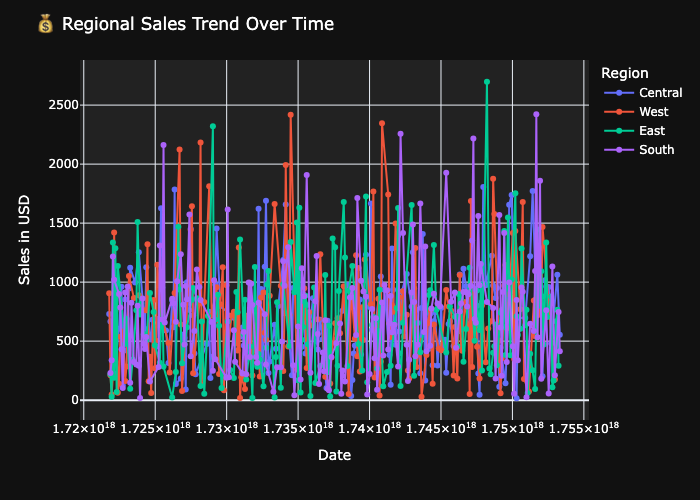
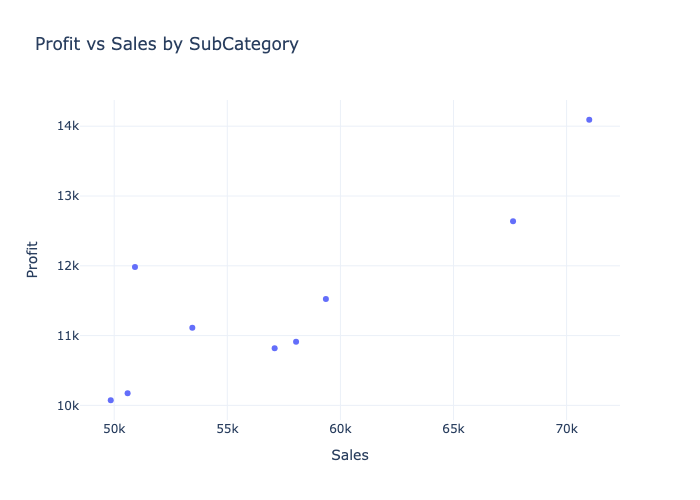
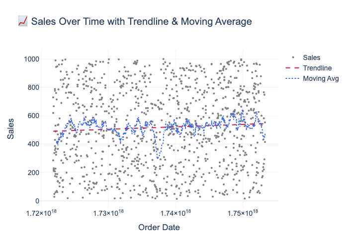

# 📊 PlotlyVizPro – Mastering Interactive Visualizations with Plotly

[](https://www.gnu.org/licenses/gpl-3.0)
[](https://www.python.org/)
[](https://jupyter.org/)
[](https://plotly.com/python/)
[](https://www.docker.com/)
[](https://github.com/SatvikPraveen/PlotlyVizPro/actions)
[](https://github.com/SatvikPraveen/PlotlyVizPro)

---

## 📦 Overview

**PlotlyVizPro** is a modular, multi-notebook visualization project crafted to help you master interactive plotting using **Plotly**, **Streamlit**, and **Python utilities**. From chart fundamentals to advanced dashboards, this project equips you with:

✅ A reusable, utility-first visualization toolkit  
✅ A thematic, notebook-driven learning framework  
✅ A polished, production-grade portfolio project

---

## 🚀 Highlights

- 📈 **Express + Graph Objects**: Built using both Plotly APIs
- 📊 **Charts**: Line, bar, pie, box, histogram, heatmap, KDE
- 🧭 **Maps**: Choropleth, Mapbox, GeoJSON overlays
- 🧮 **Statistical Add-ons**: Trendlines, Z-bands, moving averages
- 🔄 **Animations**: Sliders, dropdown filters, `animation_frame`
- 🧼 **Clean Output**: HTML for interactivity, PNG for documentation
- 🧰 **Modular Design**: Plotting utilities, reusable layout functions
- 🐳 **Docker Support**: Containerized Jupyter environment for reproducibility
- ✅ **Full Test Suite**: Comprehensive testing with pytest
- 🔄 **CI/CD Pipeline**: Automated testing and quality checks
- 📚 **Complete Documentation**: API reference, tutorials, deployment guides

---

## ⚖️ Why Plotly?

| Feature               | Matplotlib | Seaborn    | Plotly               |
| --------------------- | ---------- | ---------- | -------------------- |
| Interactivity         | ❌ Static  | ❌ Static  | ✅ Fully interactive |
| Dashboards/Animations | ❌ Minimal | ❌ Minimal | ✅ Native support    |
| Hover/Zoom Features   | ❌         | ❌         | ✅ Built-in          |
| Publication Quality   | ✅         | ✅         | ✅                   |

PlotlyVizPro builds on this by organizing all core concepts in modular, theme-consistent notebooks.

---

## 🎯 Project Philosophy

PlotlyVizPro was built to:

- 🧩 Encourage modular design using utilities and thematic structuring
- 📦 Package core visualization skills into reusable functions
- 💡 Help learners _think like developers_ by designing reusable pipelines
- 🧱 Promote reproducibility with Docker + synthetic datasets
- 🚀 Act as a launchpad for portfolio enhancement and tech interviews

---

## 🧠 Core Concepts Covered

| Area               | Concepts                                                           |
| ------------------ | ------------------------------------------------------------------ |
| Basic Charts       | Line, scatter, bar, pie, histogram, box plots                      |
| Chart Styling      | Theming, axis config, layout tuning, custom tooltips               |
| Interactivity      | Hover templates, sliders, dropdowns, callbacks                     |
| Statistical Layers | Trendlines, rolling averages, ±z-score confidence bands            |
| Dashboard Design   | Subplots, grids, shared axes, spacings, annotations                |
| Geo Visuals        | Choropleths, GeoJSON overlays, Mapbox tokens                       |
| Plot Architecture  | `.pipe()` overlays, centralized `plot_utils.py`, layout automation |
| Exports            | Dynamic HTML and static PNG renderings for reporting               |

---

### 📉 Sample: Line & Scatter





---

### 🗺️ Sample: Statistical Overlays



---
```
## 🗂️ Project Structure
├── .github/                  # GitHub workflows and templates
│   ├── workflows/           # CI/CD pipelines
│   │   ├── test.yml         # Automated testing
│   │   ├── lint.yml         # Code quality checks
│   │   └── docker.yml       # Docker build tests
│   └── ISSUE_TEMPLATE/      # Issue and PR templates
├── docs/                     # Extended documentation
│   ├── API.md               # Complete API reference
│   ├── TUTORIALS.md         # Step-by-step tutorials
│   ├── DEPLOYMENT.md        # Deployment guides
│   └── TROUBLESHOOTING.md   # Common issues & solutions
├── tests/                    # Test suite
│   ├── test_plot_utils.py   # Utility function tests
│   ├── test_data_generation.py
│   ├── test_notebooks.py
│   └── test_streamlit_app.py
├── exports/                  # HTML and PNG exports by notebook
├── notebooks/                # 10 structured Jupyter notebooks
├── pages/                    # Streamlit pages for app mode
├── utils/                    # Reusable plotting utilities
├── datasets/                # Synthetic datasets
├── .editorconfig            # Editor configuration
├── .env.example             # Environment variables template
├── .gitignore               # Git ignore patterns
├── .pre-commit-config.yaml  # Pre-commit hooks
├── config.py                # Configuration management
├── Dockerfile               # Docker environment for reproducibility
├── Makefile                 # Common development commands
├── pyproject.toml           # Modern Python project config
├── pytest.ini               # Test configuration
├── app.py                   # Main Streamlit app entry point
├── generate_datasets.py     # Generates synthetic datasets using Faker
├── requirements.txt         # Minimal dependencies to run the project
├── requirements_dev.txt     # Full dev environment
├── requirements.txt         # Minimal dependencies to run the project
└── README.md                # You're here!
```

```bash
# Clone the repo
git clone https://github.com/SatvikPraveen/PlotlyVizPro.git
cd PlotlyVizPro

# Install dependencies (creates venv automatically)
make install

# Or for development (includes testing tools)
make install-dev

# Run tests
make test

# Launch JupyterLab
make run-jupyter

# Launch Streamlit app
make run-app

# See all available commands
make help
```

### ▶️ Manual Setup

```bash
# Clone the repo
git clone https://github.com/SatvikPraveen/PlotlyVizPro.git
cd PlotlyVizPro

# Create a virtual environment
python3 -m venv venv
source venv/bin/activate  # On Windows: venv\Scripts\activate

# Install dependencies
pip install -r requirements.txt

# For development (includes testing tools)
pip install -r requirements_devatmaps      | Distribution plots, hexbin overlays          |
| 04  | Choropleth & GeoJSON Maps      | Choropleth, projections, custom shape tuning |
| 05  | Animation & Interactivity      | Sliders, dropdowns, animation_frame          |
| 06  | Dashboards & Subplots          | Grid layouts, spacing, multi-panel views     |
| 07  | Graph Objects Deep Dive        | Manual axis, layout, annotation control      |
| 08  | Mapbox & Geo Layers            | Mapbox tokens, styles, satellite maps        |
| 09  | Real-World Visualizations      | COVID & Superstore use cases                 |
| 10  | Statistical Overlays + .pipe() | Modular overlays, Z-bands, moving average    |

---

## ⚙️ Setup Instructions

### ▶️ Local Setup

```bash
# Clone the repo
git clone https://github.com/SatvikPraveen/PlotlyVizPro.git
cd PlotlyVizPro

# Create a virtual environment
python3 -m venv plotly_env
source plotly_env/bin/activate  # On Windows: plotly_env\Scripts\activate

# Install dependencies
pip install -r requirements.txt

# Launch JupyterLab
jupyter lab
```

---

## 🐳 Docker Setup (Optional)

```bash
# Build image
docker build -t plotlyvizpro .

# Run container (auto-launches JupyterLab at port 8888)
docker run -p 8888:8888 plotlyvizpro
```

🛡️ No token/password required. Uses `--allow-root` for compatibility.

---

## 🌐 Streamlit Dashboard Features

Launch the app with `streamlit run app.py` and explore:

- 🔄 Real-time filtering and visualization controls
- 📊 Embedded charts from exported HTMLs
- 🧮 Summary statistics + quick insights
- 🎨 Toggle between chart types with ease

## 🧪 Datasets

All datasets are **synthetically generated** via `generate_datasets.py` using the `faker` library.

- 🔁 Fully reproducible
- 🔓 License-free
- 🔬 Customizable complexity (sales, dates, geography, etc.)

---

## 🧰 Utility Functions (utils/plot_utils.py)

| Type          | Utilities                                                      |
| ------------- | -------------------------------------------------------------- |
| Core Charts   | `line_plot()`, `bar_plot()`, `scatter_plot()`, `box_plot()`    |
| Interactivity | Sliders, hover templates, dropdowns                            |
| Stats Add-ons | `add_trendline()`, `add_moving_average()`, `add_zscore_band()` |
| Layout Tools  | `make_subplots_custom()`, `add_annotations()`, `apply_theme()` |
| Export Tools  | `save_fig_as_html()`, `save_fig_as_png()`                      |

📚 **Full API Reference**: See [docs/API.md](docs/API.md) for complete function documentation.

---

## 🧪 Testing & Quality Assurance

PlotlyVizPro includes a comprehensive test suite and CI/CD pipeline:

```bash
# Run all tests
make test

# Run with coverage report
make test-cov

# Run code quality checks
make lint

# Auto-format code
make format
```

### Test Coverage

- ✅ Unit tests for plotting utilities
- ✅ Data generation validation
- ✅ Notebook structure verification
- ✅ Streamlit app testing
- ✅ CI/CD with GitHub Actions

### Code Quality

- **Black** for code formatting
- **Flake8** for linting
- **isort** for import sorting
- **MyPy** for type checking
- **Pre-commit hooks** for automated checks

---

## 📚 Documentation

Comprehensive documentation is available in the `docs/` directory:

- **[API Reference](docs/API.md)** - Complete function documentation
- **[Tutorials](docs/TUTORIALS.md)** - Step-by-step guides
- **[Deployment Guide](docs/DEPLOYMENT.md)** - Deploy to various platforms
- **[Troubleshooting](docs/TROUBLESHOOTING.md)** - Common issues and solutions

---

## 📤 Plot Exports

Each notebook saves plots in:

```bash
exports/
├── html/             # Interactive outputs
│   ├── 01_line_scatter/
│   ├── ...
├── images/           # PNG renders
│   ├── 01_line_scatter/
│   ├── ...
```

---

## 💼 Use Case Scenarios

- 📊 **Portfolio Project**: Showcase your visualization skills to recruiters with modular, professional-quality notebooks and dashboards.
- 🧑‍🏫 **Learning Companion**: Study Plotly’s API differences (`plotly.express` vs `graph_objects`) across notebooks.
- 🧪 **Interactive Reporting**: Generate rich HTML reports or launch dashboards with Streamlit using synthetic, reproducible datasets.
- 🧰 **Toolkit for Projects**: Plug in your own data and reuse `plot_utils.py` utilities for fast prototyping and visualization pipelines.

---

## 📌 Cheatsheet

A compact markdown cheatsheet available at:

```bash
docs/plotly_cheatsheet.md
```

Includes:

- Plotly syntax patterns
- Utility usage demos
- Dashboard tips
- Export best practices

---

## 📜 License

This project is licensed under the [GNU General Public License v3.0](https://www.gnu.org/licenses/gpl-3.0). See the [LICENSE](./LICENSE) file for more details.

---

## 🤝 Contributions Welcome

- 🛠 Got a bug fix or improvement? [Open a PR](https://github.com/SatvikPraveen/PlotlyVizPro/pulls)
- 🧠 Found a bug or want to request a feature? [File an issue](https://github.com/SatvikPraveen/PlotlyVizPro/issues)
- ⭐ If this helped you, consider starring the repository!

---

## 💬 Join the Conversation

Got an idea, stuck on something, or want to share your use-case?

👉 Visit the [Discussions](https://github.com/SatvikPraveen/PlotlyVizPro/discussions) tab and say hello!

---

## 🧭 Related Projects

Explore the full suite of Python data mastery repositories:

- 📊 [**PandasPlayground**](https://github.com/SatvikPraveen/PandasPlayground)  
  Modular pipelines for mastering data wrangling, merging, and analysis using pandas.

- 🔢 [**NumPyMasterPro**](https://github.com/SatvikPraveen/NumPyMasterPro)  
  A concept-to-implementation NumPy project covering arrays, broadcasting, and indexing.

- 📈 [**MatplotlibMasterPro**](https://github.com/SatvikPraveen/MatplotlibMasterPro)  
  Comprehensive Matplotlib practice with style guides, animations, and thematic plots.

- 🖼️ [**SeabornMasterPro**](https://github.com/SatvikPraveen/SeabornMasterPro)  
  Complete mastery of Seaborn's statistical plots, themes, dashboards, and time series.

Each project is standalone but follows a consistent **pedagogical and modular structure**, forming a **progressive learning track** in data visualization and numerical computing with Python.

---
