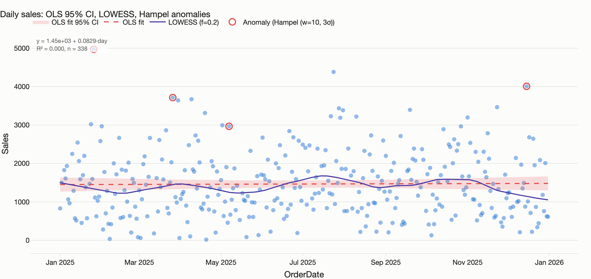
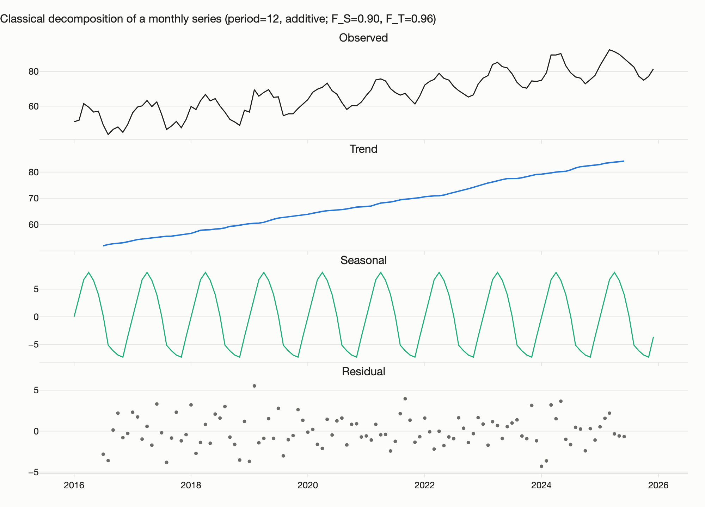
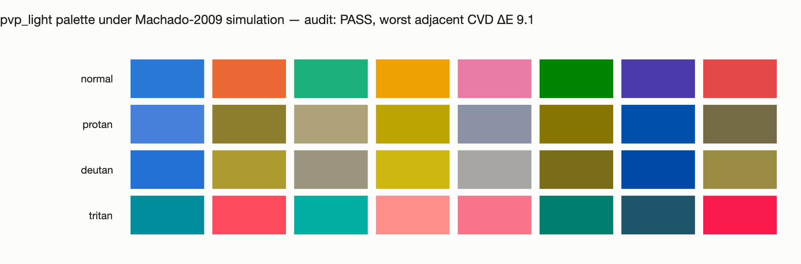
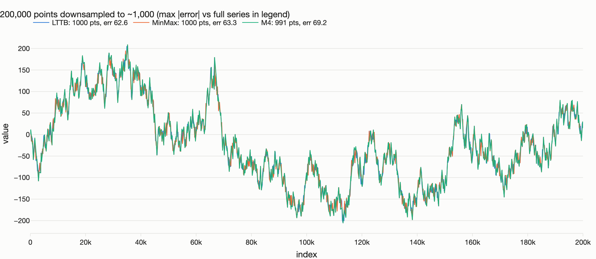

# PlotlyVizPro

**A research-grade toolkit for interactive, publication-ready Plotly figures.**

[](https://github.com/SatvikPraveen/PlotlyVizPro/actions/workflows/ci.yml)
[](https://satvikpraveen.github.io/PlotlyVizPro/)
[](https://www.python.org/)
[](pyproject.toml)
[](https://github.com/astral-sh/ruff)
[](LICENSE)
[](CITATION.cff)

Plotly makes charts interactive. PlotlyVizPro adds what a quantitative analyst
needs on top: **statistical overlays with honest uncertainty**, **palettes that
survive colour-vision deficiency**, **shape-preserving downsampling** for
million-point series, and **exports that carry their own provenance** — all
typed, tested against reference implementations, and reproducible.



## Contents

- [Why](#why) · [Install](#install) · [Quick start](#quick-start)
- [Features](#features): [statistics](#statistical-overlays) · [colour](#colour-vision-safe-palettes) · [downsampling](#downsampling-large-series) · [publication export](#publication-export-and-provenance) · [data](#reproducible-datasets) · [CLI](#command-line) · [app](#streamlit-gallery)
- [Verification](#verification) · [Benchmarks](#benchmarks) · [Project layout](#project-layout) · [Development](#development) · [Citing](#citing) · [License](#license)

## Why

Most plotting helpers stop at "draw a line through it". A figure that goes into
a paper or a decision needs more:

| Question | Plotly alone | PlotlyVizPro |
|---|---|---|
| Is that trend real? | `trendline="ols"` draws a line | OLS with *t*-based confidence **and** prediction bands, coefficient p-values, per-day slopes for datetime axes; robust LOWESS |
| How uncertain is this mean? | — | Bootstrap CIs (percentile / basic / **BCa**) with per-group error bars |
| Which points are anomalous? | — | z-score, IQR fences, rolling **Hampel**, Rosner's **generalized ESD** |
| Can a colour-blind reader tell the series apart? | default palette | Machado-2009 CVD simulation, OKLab ΔE audit, contrast check, CVD-optimal ordering; both templates ship audited |
| Will 2 M points render? | browser stalls | **LTTB / MinMax / M4** to a few thousand points with a max-error report |
| What produced this figure? | — | Provenance sidecar: package versions, git commit, SHA-256 of inputs |
| Is it the right size for the journal? | manual | Nature / IEEE / Elsevier / PLOS / ACM presets at the right DPI |

## Install

```bash
pip install "plotlyvizpro[all] @ git+https://github.com/SatvikPraveen/PlotlyVizPro"
```

Or from a clone: `pip install -e ".[all]"` (runtime), `make install-dev` (everything).
The core needs only NumPy, pandas, SciPy and Plotly; static images need `kaleido`.

## Quick start

```python
from functools import partial
import plotlyvizpro as pvp
from plotlyvizpro.data import load
from plotlyvizpro.overlays import add_anomalies, add_lowess, add_trendline

df = load("superstore")  # schema + SHA-256 verified
daily = df.groupby("OrderDate")["Sales"].sum().reset_index()
x, y = daily["OrderDate"], daily["Sales"]

fig = pvp.pipe(
    pvp.scatter_plot(daily, "OrderDate", "Sales", opacity=0.5, title="Daily sales"),
    partial(add_trendline, x=x, y=y, show_ci=True),  # OLS + 95 % CI, equation annotated
    partial(add_lowess, x=x, y=y, frac=0.2),  # robust local smoother
    partial(add_anomalies, x=x, y=y, method="hampel"),  # rolling median/MAD detector
)
fig.layout.meta["ols"]["p_values"]  # results are stored on the figure

pvp.apply_journal_preset(fig, "ieee_single")  # 3.5 in wide, 8 pt, 300 dpi
pvp.save_figure(fig, "daily_sales", formats=("html", "png", "svg"))  # + provenance sidecar
```

## Features

### Statistical overlays

`plotlyvizpro.stats` holds the estimators (no Plotly import); `plotlyvizpro.overlays` draws them.

| Estimator | Method | Cross-checked against |
|---|---|---|
| `ols_fit` | QR least squares, *t* bands, binomial-expansion SEs on the original scale | `statsmodels.OLS` (bands, SEs, p-values, adj. R²) |
| `lowess` | Cleveland 1979, tricube + bisquare robustifying iterations, `delta` speed-up | `statsmodels.nonparametric.lowess` |
| `bootstrap_ci` | percentile, basic, **BCa** with jackknife acceleration | empirical coverage simulation |
| `zscore_outliers`, `iqr_outliers`, `hampel_filter`, `generalized_esd` | see [Methods](docs/methods.md) | NIST/SEMATECH ESD worked example |
| `kde`, `ecdf`, `qq_points`, `histogram_bins`, `describe` | SciPy kernels, DKW band, probplot | SciPy |
| `seasonal_decompose`, `autocorrelation` | classical MA decomposition, strength measures | `statsmodels.tsa.seasonal_decompose` |
| `rolling`, `ewma`, `bollinger_bands`, `zscore_bands`, `savitzky_golay` | pandas / SciPy | pandas |



### Colour-vision-safe palettes

```python
from plotlyvizpro.colors import audit_palette, order_palette, simulate_cvd

print(audit_palette(["#2a78d6", "#eb6834", "#1baf7a", "#eda100"], mode="light", pairs="all").to_text())
```

Checks: OKLCH lightness band, chroma floor, CVD separation (Machado 2009,
protan/deutan, OKLab ΔE×100 ≥ 8), normal-vision floor (≥ 15), WCAG contrast
vs surface (≥ 3:1). The registered `pvp_light` and `pvp_dark` templates pass
in their mode; `order_palette` finds the slot order that maximises the minimum
adjacent CVD distance. Okabe-Ito and Paul Tol palettes are included.



### Downsampling large series

```python
from plotlyvizpro.downsample import downsample, max_error

keep = downsample(x, y, threshold=4000, method="lttb")  # indices, so other columns stay aligned
max_error(x, y, keep)
```

LTTB (Steinarsson 2013), per-bucket MinMax and M4 (Jugel et al. 2014).
One million points reduce to 4,000 in about 40 ms.



### Publication export and provenance

`apply_journal_preset(fig, "nature_single")` sizes the figure to 89 mm and sets
7 pt text; `save_image` reads the preset's DPI back so the PNG lands at the
right pixel width. `save_figure` writes HTML/PNG/SVG/PDF/JSON plus
`<stem>.provenance.json` (package versions, platform, git commit with a
`-dirty` flag, SHA-256 of registered inputs, parameters, seed), and stores the
same record in `fig.layout.meta` so it survives JSON round-trips.

### Reproducible datasets

Eight synthetic datasets are generated from one seeded `numpy.random.Generator`
and described in `datasets/manifest.json` (SHA-256, size, rows, columns).
`data.load("covid")` verifies the digest, parses dates and checks the schema.

### Command line

```
plotlyvizpro info                     # versions, export dir, image-engine status
plotlyvizpro generate-data --seed 42  # regenerate datasets + manifest
plotlyvizpro verify-data              # exit 1 on checksum mismatch
plotlyvizpro audit-palette pvp_dark --mode dark
plotlyvizpro audit-palette "#2a78d6,#eb6834" --pairs all --json
plotlyvizpro demo --formats html,png  # showcase figure with overlays
plotlyvizpro benchmark --n 1000000    # time the downsamplers
```

### Streamlit gallery

`make run-app` serves the ten notebook galleries plus three research pages:
**Statistical lab** (any dataset, any column, every overlay, coefficient table,
bootstrap CIs, KDE/ECDF/Q-Q), **Palette audit** (paste hex colours, see them
under simulated protan/deutan/tritan vision) and **Downsampling** (LTTB vs
MinMax vs M4 on up to 1 M points with timing and error). Every page is executed
headlessly in CI via `streamlit.testing`.

## Verification

| Gate | Tool | Status |
|---|---|---|
| Lint + format | ruff (pycodestyle, pyflakes, isort, bugbear, pyupgrade, pydocstyle, numpy, pandas, pytest rules) | clean |
| Types | mypy `--strict` | clean |
| Unit + property tests | pytest, Hypothesis; 250+ tests | 98 % branch coverage (85 % floor enforced) |
| Numerical cross-checks | statsmodels, SciPy, NIST worked example | rtol ≤ 1e-6 where closed-form |
| Notebooks | nbclient executes all ten | CI job |
| App | `AppTest` runs 14 pages | CI matrix |
| Image export | kaleido renders PNG/SVG/PDF at preset DPI | CI job |
| Matrix | Python 3.10-3.13 on Linux; 3.12 on macOS and Windows | CI |

## Benchmarks

| task | time |
|---|---:|
| LTTB, 1,000,000 → 4,000 points | 42 ms |
| MinMax, 1,000,000 → 4,000 | 22 ms |
| M4, 1,000,000 → 1,000 px | 17 ms |
| OLS with bands, n = 50,000 | 6.5 ms |

Apple M-series laptop; `make bench` reproduces the full `pytest-benchmark`
table, and CI uploads `benchmark.json` on every push. Details in
[docs/benchmarks.md](docs/benchmarks.md).

## Project layout

```
plotlyvizpro/          the package (charts, layout, theme, colors, stats/, overlays,
                       downsample, export, provenance, data, datasets, cli)
tests/                 unit, property and cross-validation tests; AppTest for the app
benchmarks/            pytest-benchmark suite
notebooks/             10 tutorial notebooks (01 line/scatter … 10 statistical overlays)
pages/, app.py         Streamlit gallery + research pages
examples/              runnable scripts, including examples/05_research/
datasets/              seeded synthetic CSVs + manifest.json
exports/               HTML/PNG gallery regenerated from the notebooks
docs/, mkdocs.yml      site: getting started, architecture, methods, reproducibility, API
utils/plot_utils.py    backward-compatible facade used by the notebooks
```

## Development

```bash
make install-dev   # .venv, extras, pre-commit hooks
make check         # ruff + mypy + pytest (what CI runs)
make test-notebooks
make bench
make docs-serve
```

Contributions are welcome; see [CONTRIBUTING.md](CONTRIBUTING.md) and the
[architecture notes](docs/architecture.md).

## Citing

If this toolkit helps your research, cite it via the repository's
[`CITATION.cff`](CITATION.cff) (GitHub renders a "Cite this repository"
button). The file also lists the primary references for the implemented
methods: Cleveland (1979), Efron & Tibshirani (1993), Rosner (1983), Machado,
Oliveira & Fernandes (2009), Ottosson (2020), Steinarsson (2013), Jugel et al. (2014).

## License

GPL-3.0-or-later. See [LICENSE](LICENSE).
